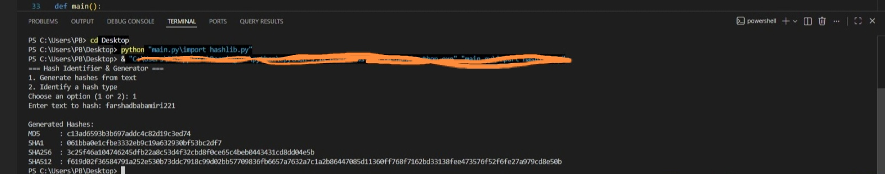
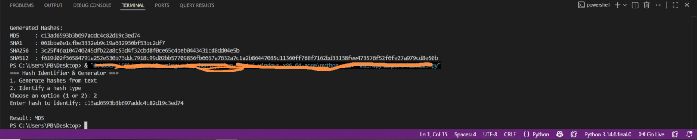

# Hash Identifier & Generator

A Python command-line tool that generates common cryptographic hashes from text and identifies the likely algorithm of a given hash based on its length and format.

## Features
- Generates MD5, SHA1, SHA256, and SHA512 hashes from any text input
- Identifies the likely hash type of a given hash string
- Simple interactive CLI menu
- Input validation for non-hexadecimal strings

## How to Run
Run the script using:

    python main.py

## Example: Generating Hashes

## Example: Identifying a Hash

## Why I Built This
This project deepened my understanding of one-way hash functions, a core concept in password storage, data integrity verification, and digital forensics. It's part of my ongoing learning journey in cybersecurity.

## Real-World Use Cases
- Password storage: systems store password hashes instead of raw passwords
- File integrity checks: comparing hashes before/after transfer detects tampering
- Malware analysis: security analysts match file hashes against known malware databases
- Duplicate detection: comparing hashes is faster than comparing full file contents

## License
MIT
